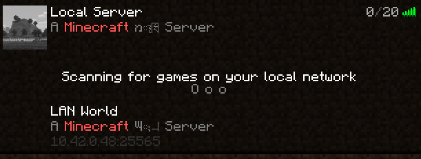

# Server on LAN
A simple mod to advertise the given server on a LAN network, in addition to the normal methods of connection.
Useful for decluttering localhost and such off your server menu.
- Only runs on the server
- Confirmed to run on 1.17.1, but probably runs on any future and previous version

### Known issue
- Multi line MOTDs are not respected. This can't be fixed as it's a client issue.